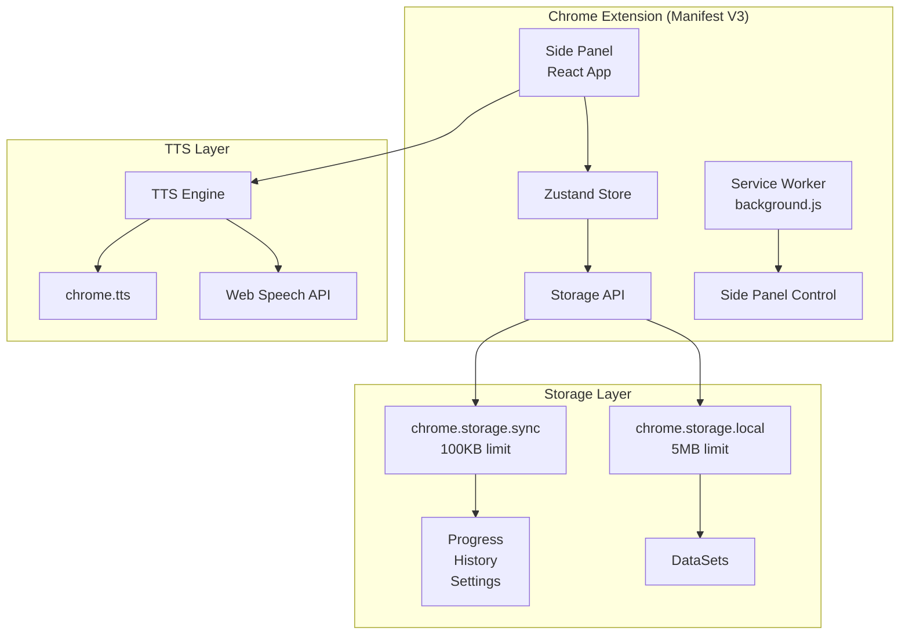
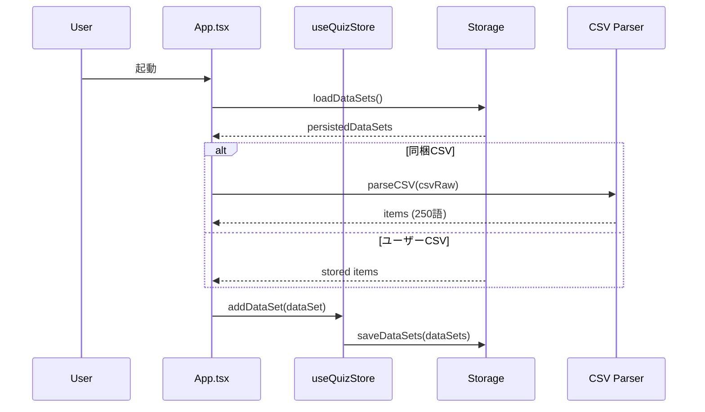
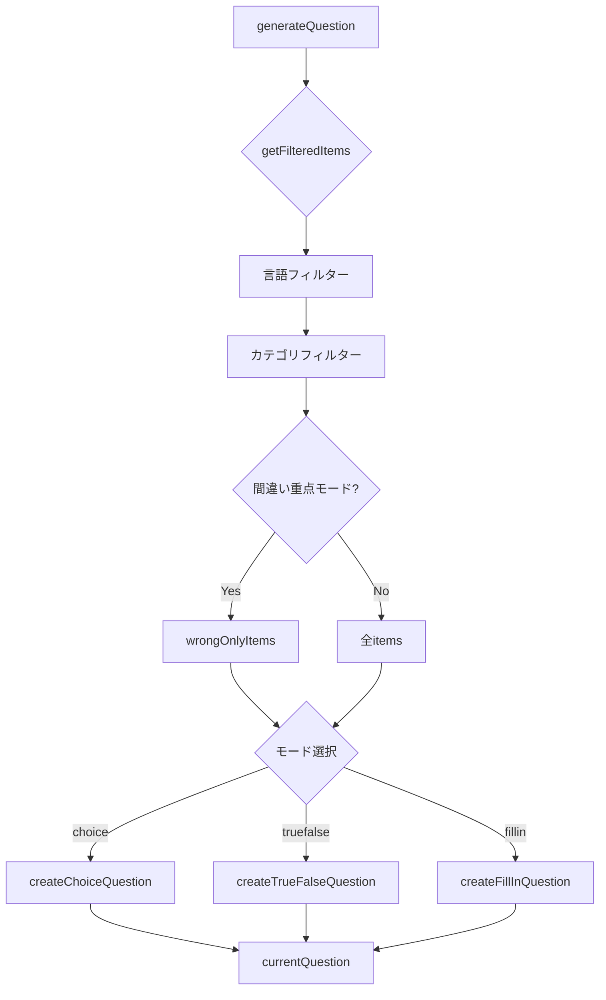

# LinguaDock 技術仕様書

## アーキテクチャ概要



---

## データフロー



---

## クイズ生成フロー



---

## ストレージ設計

### chrome.storage.sync（100KB上限）
| キー | 内容 |
|------|------|
| `polishbridge_progress` | 学習進捗（今日の問題数、正答数等） |
| `polishbridge_history` | アイテムごとの正誤履歴 |
| `polishbridge_settings` | ユーザー設定 |
| `linguadock_first_launch` | 初回起動フラグ |

### chrome.storage.local（5MB上限）
| キー | 内容 |
|------|------|
| `linguadock_datasets` | データセット一覧（同梱/ユーザーCSV） |

> **重要**: 同梱CSVはitemsを永続化しない。ロード時にバンドルから再パースする。

---

## DataSet型定義

```typescript
interface DataSet {
    id: string;           // UUID
    name: string;         // 表示名
    langCode: string;     // 言語コード
    isBuiltIn: boolean;   // 同梱CSV
    isLoaded: boolean;    // ロード状態
    isLocked: boolean;    // ロック状態
    items: LearningItem[];
    createdAt?: string;
}
```

### 状態遷移マトリックス
| 操作 | 同梱CSV | ユーザーCSV | ロック時 |
|------|:-------:|:----------:|:--------:|
| ロード | ✅ | ✅ | ✅ |
| アンロード | ✅ | ✅ | ❌ |
| 削除 | ❌ | ✅ | ❌ |

---

## デバッグモード

### 有効化方法
1. 設定画面を開く
2. 下部の「🔧 開発者向け」セクション
3. 「デバッグモード」をON

### 出力されるログ

| タグ | 内容 |
|------|------|
| `[App]` | 初期化、データセット読込 |
| `[TTS]` | 音声合成リクエスト、結果 |
| `[CSV]` | CSVパース、バージョン検出 |
| `[Storage]` | 保存・読込・クリア操作 |

### コンソールでの確認方法
1. サイドパネル内で右クリック → 「検証」
2. Console タブを開く
3. `[App]`, `[TTS]` 等のタグ付きログを確認

---

## トラブルシューティング

### 🔴 語数が正しく表示されない

**原因**: 古いキャッシュデータが残っている

**解決方法**:
1. 設定 → 「🗑️ すべてのデータを初期化」
2. 拡張機能をリロード

### 🔴 音声が再生されない

**原因**: TTS設定またはブラウザ権限

**解決方法**:
1. 設定 → 音声エンジンを確認（Chrome TTS / Web Speech）
2. ブラウザのサイト設定で音声を許可

### 🔴 CSVインポートでエラー

**原因**: CSV形式の不備

**チェックリスト**:
- [ ] ヘッダー行がある
- [ ] `id,lang,text,reading_kana,meaning_ja` が必須列
- [ ] UTF-8エンコーディング
- [ ] 改行コードが統一されている（CRLF推奨）

### 🔴 拡張機能が更新されない

**原因**: Service Workerキャッシュ

**解決方法**:
1. `chrome://extensions` を開く
2. LinguaDockの更新ボタン（⟳）をクリック
3. サイドパネルを閉じて再度開く

### 🔴 ストレージをクリアしたい

**方法1**: 設定 → 「すべてのデータを初期化」

**方法2**: 開発者ツールで:
```javascript
// サイドパネルのConsoleで実行
chrome.storage.local.clear(() => console.log('cleared'));
chrome.storage.sync.clear(() => console.log('cleared'));
```

---

## パーミッション

| パーミッション | 用途 | 最小限？ |
|---------------|------|:--------:|
| `storage` | 進捗・設定・データセット保存 | ✅ |
| `sidePanel` | サイドパネル表示 | ✅ |
| `tts` | テキスト読み上げ | ✅ |

> **プライバシー**: ネットワーク通信なし。すべてローカル完結。

---

## ビルド構成

### 依存関係
| ライブラリ | バージョン | 用途 |
|-----------|-----------|------|
| React | 19 | UIフレームワーク |
| Zustand | 5 | 状態管理 |
| Tailwind CSS | 4 | スタイリング |
| Vite | 7 | ビルドツール |
| papaparse | 5 | CSV解析 |
| TypeScript | 5.9 | 型システム |

### ビルドコマンド
```bash
npm run dev    # 開発サーバー
npm run build  # 本番ビルド
npm run lint   # ESLint
```

### 出力サイズ
| ファイル | サイズ | gzip |
|----------|--------|------|
| sidepanel.js | ~430KB | ~131KB |
| sidepanel.css | ~51KB | ~8.6KB |

---

## 開発者向けフォークガイド

### 1. CSVカスタマイズ
1. `src/data/` に新しいCSVを追加
2. `src/lib/builtInDataSets.ts` に登録
3. `src/sidepanel/App.tsx` でインポート追加

### 2. 言語追加
`src/types/learning.ts` の `SUPPORTED_LANGUAGES` に追加:
```typescript
{ code: 'xx', name: '新言語', emoji: '🇽🇽', ttsLang: 'xx-XX' }
```

### 3. テーマカスタマイズ
`src/index.css` のCSS変数を変更:
```css
--primary: 220 90% 56%;
--accent: 210 40% 96%;
```

---

## ファイル構造

```
polish-bridge/
├── public/
│   ├── manifest.json      # MV3 マニフェスト
│   ├── background.js      # Service Worker
│   └── icons/             # 拡張機能アイコン
├── src/
│   ├── components/        # UIコンポーネント
│   ├── data/              # 同梱CSVファイル
│   ├── lib/               # ユーティリティ
│   │   ├── storage.ts     # ストレージ管理
│   │   ├── csvHandler.ts  # CSV解析
│   │   ├── tts.ts         # 音声合成
│   │   └── debug.ts       # デバッグログ
│   ├── store/
│   │   └── useQuizStore.ts # Zustand Store
│   ├── types/
│   │   └── learning.ts    # 型定義
│   └── sidepanel/
│       └── App.tsx        # メインアプリ
└── dist/                  # ビルド出力
```
